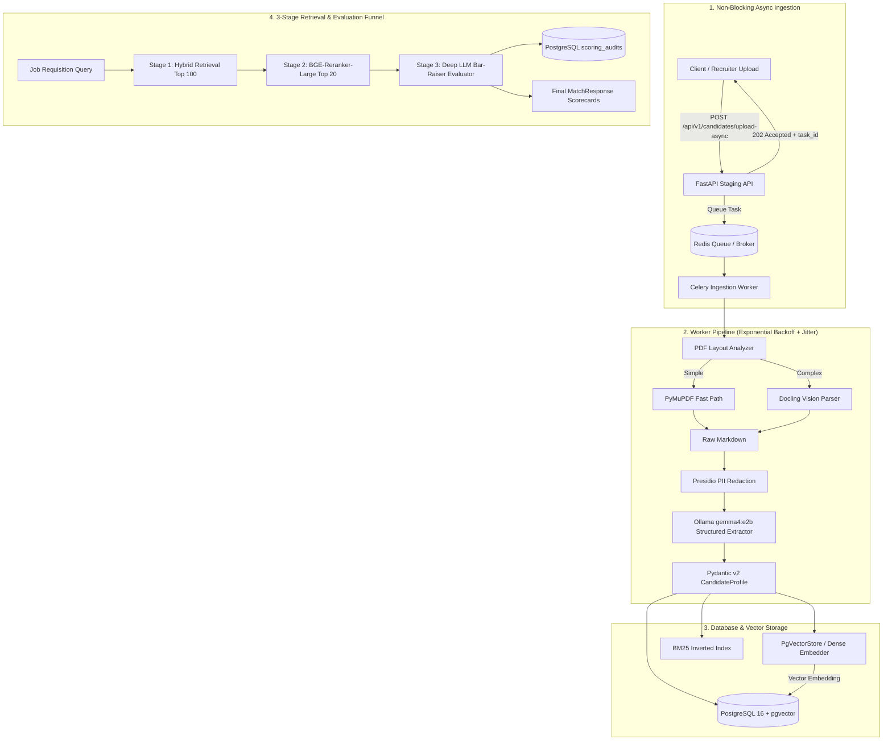
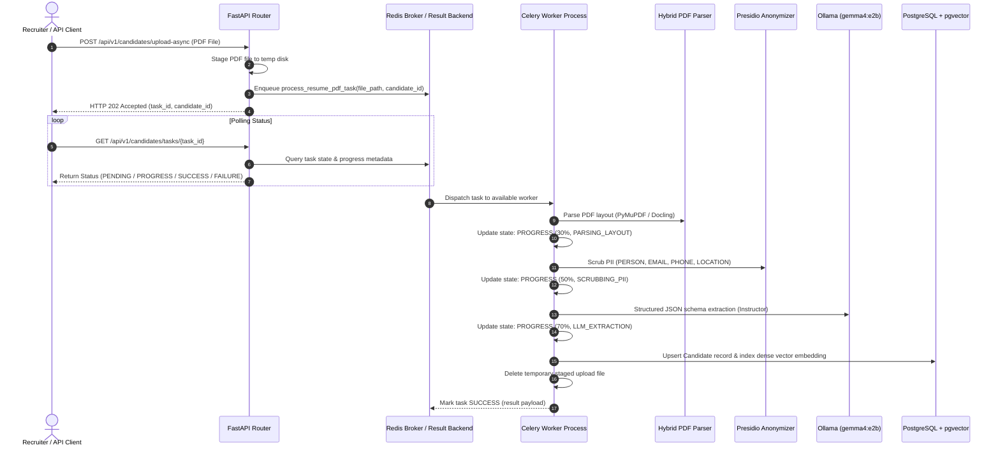
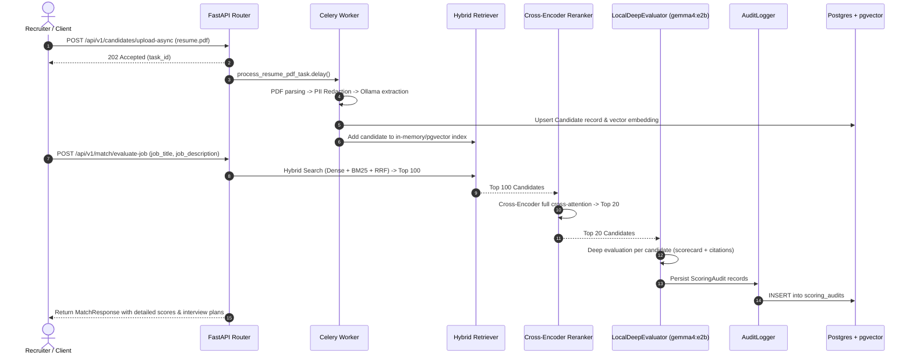

# AI-Powered Applicant Tracking System (ATS Core)
## System Architecture & End-to-End Workflow

This document provides a comprehensive technical overview of the AI-powered Applicant Tracking System (ATS Core) engine, its architectural components, asynchronous background ingestion worker pipelines, data schemas, 3-stage candidate search & re-ranking funnel, and deep evaluation workflows.

---

## Table of Contents
1. [Executive Overview](#1-executive-overview)
2. [High-Level Architecture Diagram](#2-high-level-architecture-diagram)
3. [Asynchronous Background Ingestion Pipeline (Celery + Redis + FastAPI)](#3-asynchronous-background-ingestion-pipeline-celery--redis--fastapi)
4. [The 3-Stage Candidate Retrieval & Scoring Funnel](#4-the-3-stage-candidate-retrieval--scoring-funnel)
5. [End-to-End Ingestion & Processing Sequence](#5-end-to-end-ingestion--processing-sequence)
6. [Core Components Deep Dive](#6-core-components-deep-dive)
   - [6.1 Asynchronous Celery Worker & Tasks](#61-asynchronous-celery-worker--tasks)
   - [6.2 Hybrid PDF Layout Parser](#62-hybrid-pdf-layout-parser)
   - [6.3 PII Redaction & Privacy Engine](#63-pii-redaction--privacy-engine)
   - [6.4 Structured Schema Ingestion](#64-structured-schema-ingestion)
   - [6.5 Hybrid Retrieval Engine (Dense + BM25 + RRF)](#65-hybrid-retrieval-engine-dense--bm25--rrf)
   - [6.6 Stage 2 Cross-Encoder Re-Ranker (BGE-Reranker-Large)](#66-stage-2-cross-encoder-re-ranker-bge-reranker-large)
   - [6.7 Stage 3 Deep LLM Evaluator (Ollama gemma4:e2b)](#67-stage-3-deep-llm-evaluator-ollama-gemma4e2b)
   - [6.8 Database & Vector Store (PostgreSQL + pgvector)](#68-database--vector-store-postgresql--pgvector)
   - [6.9 Audit Logger & Compliance Persistence](#69-audit-logger--compliance-persistence)
7. [Audit, Telemetry & Compliance](#7-audit-telemetry--compliance)
8. [Directory & File Structure](#8-directory--file-structure)
9. [How to Run & Validate](#9-how-to-run--validate)

---

## 1. Executive Overview

The **ATS Core Engine** is a privacy-first, bias-mitigating, high-performance candidate parsing, hybrid matching, and deep LLM evaluation system. It transforms raw, unstructured candidate resumes (PDFs) into normalized, privacy-compliant, structured profiles using an asynchronous background queue (Celery + Redis) with exponential backoff retries and jitter, and indexes them for multi-channel hybrid retrieval, deep cross-attention re-ranking, and bar-raiser LLM evaluations.

### Key Highlights:
- **Non-Blocking Async Ingestion**: FastAPI accepts resume uploads immediately (`202 Accepted`), staging files and delegating processing to Celery workers backed by Redis.
- **Exponential Backoff with Jitter**: Resilient retry policy ($2^{\text{attempt}} \times \text{interval}$ with randomized jitter $\pm 50\%$) handling OCR timeouts, PDF rendering edge cases, and local LLM concurrency limits.
- **Intelligent Hybrid Parsing**: Fast PyMuPDF extraction for single-column resumes with automatic Docling layout vision fallback for multi-column and tabular layouts.
- **Strict PII De-Identification**: Presidio-powered redaction of candidate names, phone numbers, emails, and exact locations prior to any LLM processing.
- **3-Stage Matching Funnel**:
  1. *Stage 1*: Fast Hybrid Retrieval (Dense BGE-small + Sparse BM25 + RRF) retrieves **Top 100**.
  2. *Stage 2*: Deep Cross-Attention Re-Ranking (`BAAI/bge-reranker-large`) filters down to **Top 20**.
  3. *Stage 3*: Deep LLM Evaluation (`LocalDeepEvaluator` with `gemma4:e2b`) produces multi-factor criteria scorecards, verbatim citations, risk assessments, and targeted interview questions.
- **Enterprise Vector Storage**: PostgreSQL 16 with `pgvector` HNSW indexes and metadata-payload filtering.
- **EEOC & Audit Compliance**: `AuditLogger` writes immutable audit entries to `scoring_audits` tracking LLM telemetry, prompts, token counts, and scoring rationales.

---

## 2. High-Level Architecture Diagram



---

## 3. Asynchronous Background Ingestion Pipeline (Celery + Redis + FastAPI)



---

## 4. The 3-Stage Candidate Retrieval & Scoring Funnel

```
┌─────────────────────────────────────────────────────────────────────────────┐
│                       3-STAGE ATS RETRIEVAL FUNNEL                          │
│                                                                             │
│  [Candidate Database: 10,000+ Profiles]                                     │
│       │                                                                     │
│       ▼                                                                     │
│  ┌───────────────────────────────────────────────────────────────────────┐  │
│  │ STAGE 1: Fast Hybrid Search (Dense BGE + Sparse BM25 + RRF)           │  │
│  │ Latency: ~15-30ms | Recall@100: >95%                                  │  │
│  └───────────────────────────────────────────────────────────────────────┘  │
│       │ (Top 100 Candidates)                                                │
│       ▼                                                                     │
│  ┌───────────────────────────────────────────────────────────────────────┐  │
│  │ STAGE 2: Deep Cross-Encoder Re-Ranking (BAAI/bge-reranker-large)      │  │
│  │ Full query-document cross-attention | Eliminates keyword stuffers     │  │
│  └───────────────────────────────────────────────────────────────────────┘  │
│       │ (Top 20 High-Relevance Candidates)                                  │
│       ▼                                                                     │
│  ┌───────────────────────────────────────────────────────────────────────┐  │
│  │ STAGE 3: Deep LLM Bar-Raiser Evaluation (Ollama: gemma4:e2b)          │  │
│  │ Multi-factor scorecard, verbatim citations, risks, interview plan     │  │
│  └───────────────────────────────────────────────────────────────────────┘  │
│       │                                                                     │
│       ▼                                                                     │
│  [PostgreSQL scoring_audits & Final Recommendations]                        │
└─────────────────────────────────────────────────────────────────────────────┘
```

---

## 5. End-to-End Ingestion & Processing Sequence



---

## 6. Core Components Deep Dive

### 6.1 Asynchronous Celery Worker & Tasks
- **Source**: `src/ats_core/workers/celery_app.py`, `src/ats_core/workers/tasks.py`
- **Key Classes / Functions**: `celery_app`, `BaseTaskWithRetry`, `process_resume_pdf_task`
- **Mechanism**:
  - `BaseTaskWithRetry`: `retry_backoff=True`, `retry_backoff_max=300`, `retry_jitter=True`, `max_retries=5`.
  - Task execution time limits: hard kill at 300s, soft timeout at 240s.
  - Worker concurrency tuned with `prefetch_multiplier=1` and `max_tasks_per_child=50` to prevent memory leaks from PDF rendering.

---

### 6.2 Hybrid PDF Layout Parser
- **Source**: `src/ats_core/parsers/pdf_parser.py`
- **Key Classes**: `PDFLayoutAnalyzer`, `HybridPDFParser`
- **Mechanism**: Fast PyMuPDF extraction with Docling vision layout analysis for complex multi-column documents.

---

### 6.3 PII Redaction & Privacy Engine
- **Source**: `src/ats_core/parsers/anonymizer.py`
- **Key Class**: `ResumeAnonymizer`
- **Mechanism**: Microsoft Presidio + spaCy NER masking `PERSON`, `EMAIL_ADDRESS`, `PHONE_NUMBER`, `LOCATION`.

---

### 6.4 Structured Schema Ingestion
- **Source**: `src/ats_core/parsers/ollama_extractor.py`, `src/ats_core/schema/candidate.py`
- **Mechanism**: Pydantic v2 validation via `instructor` over local Ollama models with self-correction.

---

### 6.5 Hybrid Retrieval Engine (Dense + BM25 + RRF)
- **Source**: `src/ats_core/search/dense_embedder.py`, `src/ats_core/search/bm25_indexer.py`, `src/ats_core/search/hybrid_retriever.py`
- **Mechanism**: FastEmbed `BAAI/bge-small-en-v1.5` dense embeddings + `BM25Okapi` with domain tokenizer merged using Reciprocal Rank Fusion ($k=60$).

---

### 6.6 Stage 2 Cross-Encoder Re-Ranker (BGE-Reranker-Large)
- **Source**: `src/ats_core/search/reranker.py`
- **Key Class**: `CandidateReranker`
- **Model**: `BAAI/bge-reranker-large`
- **Mechanism**: Full cross-attention over `(Query, Candidate)` text pairs, Sigmoid normalization, and top_k trimming.

---

### 6.7 Stage 3 Deep LLM Evaluator (Ollama gemma4:e2b)
- **Source**: `src/ats_core/evaluator/deep_evaluator.py`, `src/ats_core/schema/evaluation.py`
- **Key Classes**: `LocalDeepEvaluator`, `DeepCandidateEvaluationReport`, `CriterionScore`, `SuggestedInterviewQuestion`
- **Model**: `gemma4:e2b` via local Ollama endpoint (`http://localhost:11434/v1`).

---

### 6.8 Database & Vector Store (PostgreSQL + pgvector)
- **Source**: `schema.sql`, `src/ats_core/models/db.py`, `src/ats_core/db/vector_store.py`
- **Mechanism**: PostgreSQL 16 + pgvector HNSW indexing (`vector_cosine_ops`, $m=16$, $ef=64$) and GIN payload filtering.

---

### 6.9 Audit Logger & Compliance Persistence
- **Source**: `src/ats_core/evaluator/audit_logger.py`
- **Key Class**: `AuditLogger`
- **Mechanism**: Persists immutable audit records into the `scoring_audits` table in PostgreSQL.

---

## 7. Directory & File Structure

```
Applicant Tracking System/
├── docker-compose.yml              # PostgreSQL 16 + Redis container definitions
├── README.md                       # Project root documentation
├── WORKFLOW.md                     # System architecture & workflow documentation (this file)
└── ats-core/
    ├── docker-compose.yml          # Local container definitions
    ├── main.py                     # FastAPI main application
    ├── pyproject.toml              # Dependencies & build configuration
    ├── schema.sql                  # PostgreSQL DDL with pgvector HNSW indexes
    ├── benchmark_evaluation_latency.py # LLM evaluation latency & zero rate-limit drop benchmark
    ├── benchmark_recall.py         # Retrieval benchmark (Dense vs BM25 vs Hybrid Recall@K)
    ├── test_async_pipeline.py      # Async Celery & FastAPI verification test
    ├── test_deep_evaluator.py      # Stage 3 Deep Evaluator verification test
    ├── test_reranker.py            # BGE Cross-Encoder re-ranker verification test
    ├── src/
    │   └── ats_core/
    │       ├── api/
    │       │   ├── v1/candidates.py # Async PDF upload & task polling router
    │       │   └── v1/match.py      # End-to-end 3-stage matching API router
    │       ├── db/
    │       │   ├── init_db.py       # Database schema provisioning script
    │       │   └── vector_store.py  # Async pgvector store with payload filters
    │       ├── evaluator/
    │       │   ├── audit_logger.py  # Persists scoring audits to PostgreSQL
    │       │   ├── deep_evaluator.py# Stage 3 Deep LLM evaluation (gemma4:e2b)
    │       │   └── llm_evaluator.py # LLM evaluator utilities
    │       ├── models/
    │       │   └── db.py            # SQLAlchemy 2.0 ORM models
    │       ├── parsers/
    │       │   ├── anonymizer.py    # Microsoft Presidio PII redaction engine
    │       │   ├── ollama_extractor.py # Local Ollama structured extraction via Instructor
    │       │   └── pdf_parser.py    # Hybrid PyMuPDF / Docling layout parser
    │       ├── schema/
    │       │   ├── candidate.py     # Master CandidateProfile Pydantic schema
    │       │   ├── evaluation.py    # DeepCandidateEvaluationReport & scorecard schemas
    │       │   ├── skills.py        # SkillsTaxonomy and ExtractedSkill schemas
    │       │   └── timeline.py      # EmploymentTimeline and WorkExperience schemas
    │       ├── search/
    │       │   ├── bm25_indexer.py  # BM25 lexical indexer with tech tokenization
    │       │   ├── dense_embedder.py# FastEmbed dense BGE vector embedder
    │       │   ├── hybrid_retriever.py# RRF hybrid multi-channel retriever
    │       │   ├── pgvector_store.py# PgVectorStore embedding generator helper
    │       │   └── reranker.py      # BAAI/bge-reranker-large Cross-Encoder
    │       └── workers/
    │           ├── celery_app.py    # Celery application & worker config
    │           └── tasks.py         # Async resume ingestion task with exponential backoff & jitter
    └── test/
        ├── test_async_pipeline.py   # Async Celery & FastAPI endpoint tests
        ├── test_deep_evaluator.py   # Deep evaluator pytest suite
        ├── test_llm_benchmark.py    # LLM evaluation latency & rate-limit verification
        ├── test_reranker.py         # Cross-encoder pytest suite
        ├── test_schema.py           # Pydantic v2 schema generation & coercion tests
        └── test_vector_search.py    # pgvector HNSW and payload filter verification
```

---

## 8. How to Run & Validate

### 8.1 Start PostgreSQL & Redis
```bash
docker compose up -d
```

### 8.2 Start Celery Worker Process
```bash
cd ats-core
uv run celery -A ats_core.workers.celery_app worker --loglevel=info --concurrency=4
```

### 8.3 Launch FastAPI Web Server
```bash
uv run uvicorn main:app --host 0.0.0.0 --port 8000 --reload
```

### 8.4 Trigger Async Resume Upload & Poll
```bash
# Upload resume (returns HTTP 202 Accepted with task_id)
curl -X POST "http://localhost:8000/api/v1/candidates/upload-async" \
  -H "Accept: application/json" \
  -F "file=@sample_resume.pdf"

# Poll task status
curl "http://localhost:8000/api/v1/candidates/tasks/<TASK_ID>"
```

### 8.5 Run LLM Evaluation Latency & Reliability Benchmark (< 3s target)
```bash
uv run python benchmark_evaluation_latency.py
```

### 8.6 Run Full Pytest Suite (9 tests)
```bash
uv run python -m pytest test/
```
