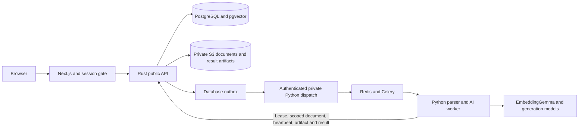

# Rust core and private Python AI

The active implementation lives in `ats-system/`. The outer Python, Go and frontend copies are legacy checkouts. The root and nested default Compose files both select `compose.architecture.yml`; the previous configurations are preserved as `docker-compose.legacy.yml` and `compose.legacy.yml` respectively.

## Service ownership



Rust is the sole business writer. Python's new entry points do not expose the old candidate/job endpoints or use their in-memory stores. The old services remain available explicitly for rollback and export, outside the new default deployment.

The new `ats_v2` schema contains tenants, accounts/memberships/sessions, jobs, candidates, versioned documents, independent applications/stages, notes, durable processing jobs, outbox delivery, immutable evaluation history, 768-dimensional embeddings, audit events, tenant taxonomy, agency clients/submissions and legacy import mappings. Business tables enforce row-level tenant policies. The application connects with `ats_runtime`; migrations use a separate administrator. Neither Python nor the browser receives database credentials.

Human identity uses Argon2 passwords and hashed, expiring opaque session tokens in HttpOnly cookies. Permissions and workspace membership are checked on the server. Browser write requests using cookies require an allowed Origin. Production uses secure cookies behind HTTPS. Self-registration is disabled by default; the local initializer deliberately enables it for development.

## Upload and recovery

An upload stores a private PDF and atomically records its candidate/document/application, processing job and outbox event. `Idempotency-Key` is tenant-scoped and rejects reuse with different inputs. The API returns 202; the browser polls the durable job record.

Python receives a scoped job identity, obtains a lease and attempt token, downloads only that job's document, verifies its hash, and uses an approved taxonomy snapshot. It retains parsing, privacy redaction, skill evidence, embeddings, reranking and evaluation algorithms from the existing package. Snapshot parsing and context enrichment avoid global tenant catalogs.

A worker saves a versioned artifact before sending its result. Rust validates service identity, lease/attempt, document version, candidate revision and job revision before applying allowed fields in one transaction. Duplicate identical results are acknowledged. Recruiter edits, newer documents and withdrawn applications prevent old results from overwriting current facts. Expired leases and unacknowledged broker messages are recovered from database state; a saved result artifact can finish a lost callback without repeating inference.

Extraction survives optional embedding/evaluation failure and remains available for manual review. Scores are saved only when actual evaluation completes. Matching uses tenant-scoped PostgreSQL full-text retrieval plus pgvector dense retrieval and reciprocal-rank fusion; its lexical implementation replaces the legacy process-wide BM25 corpus. Private cross-encoder reranking receives only the authorized shortlist. Model failure produces an explicit fallback. No database connection or business lock remains open during ranking calls.

Public profiles, notes, scorecards, ranked lists, dashboard cards and submission snapshots mask known contacts and explicit identifiers. Original PDF access and contact reveal require permission and record audit events. Privacy masking preserves UUID resource identities. Profile edits remove obsolete vectors and current scores. A replacement upload accepts `candidate_id`, adds a document version and increments the candidate revision; it preserves earlier documents and evaluation history.

## Frontend

Private evaluations require an explicit finite score and nonempty scored assessments. Missing or malformed model reports remain unscored; legacy report defaults cannot become saved evidence. Local Ollama generation uses JSON Schema, bounded output and thinking control, as described in [Ollama's compatibility documentation](https://docs.ollama.com/api/openai-compatibility). PDF coordinates are resolved from the uploaded document instead of accepted from model predictions.

The default client calls Rust through the same-origin `/core-api` proxy. It restores cookie sessions, supports workspace switching, clears the current workspace on sign-out/session expiry and uses the actual user identity in the sidebar. Candidate applications have independent stages and scorecards. Settings save workspace names and add existing accounts as members. Analytics query persisted stages, processing states and recorded time-to-hire. Agency workspaces have client/submission screens. Existing demonstration settings/analytics are retained only for explicit `NEXT_PUBLIC_ATS_BACKEND=legacy` builds.

`contracts/openapi-core.json` derives request schemas from Rust DTOs through Utoipa; `/openapi.json` serves the same document. Dynamic extracted-profile responses remain open schemas. The TypeScript client is manually maintained and type-checked, rather than generated. Private dispatch/result JSON schemas are generated from Pydantic. The core also enforces semantic model/score/version rules that JSON Schema cannot express by itself.

## Local startup

From the repository root, run:

```powershell
& '.\ats-system\deploy\Initialize-Architecture.ps1'
docker compose up -d --build
```

The initializer creates `.env.architecture` with random secrets and preserves an existing configuration. Secrets, private exports and runtime files are ignored by Git. Browser: `http://localhost:3000`; Rust: `http://127.0.0.1:8080`; database: localhost 5544; Redis: localhost 6380; document storage: localhost 9002 and console 9003. Python AI has no published host port in Compose. These ports and named volumes are separate from the legacy installation.

The Next.js container proxy destination is supplied at build time with `ATS_CORE_URL` (default `http://core:8080`). Rebuild the frontend if changing that destination. Its browser API path stays relative. AI/model configuration belongs only to the private services. Configure a generation endpoint with `OLLAMA_BASE_URL`/`OLLAMA_MODEL`, or an explicitly supplied provider credential. `ATS_EMBEDDING_BACKEND`, `ATS_EMBEDDING_BASE_URL`, `ATS_EMBEDDING_MODEL` and `HF_TOKEN` can be supplied for the chosen private EmbeddingGemma deployment. The result model remains `google/embeddinggemma-2`, dimension 768. Set `ATS_AI_ENABLE_LLM=false` and `ATS_AI_ENABLE_EMBEDDINGS=false` for extraction-only development.

The local storage implementation uses [RustFS's S3-compatible deployment](https://github.com/rustfs/rustfs), with a verified image digest and private bucket initialization. The earlier MinIO image references failed to pull. Production can use an existing private S3 provider through the core's AWS configuration; local HTTP is explicitly enabled only for development.

## Temporary local testing without sign-in

Set `ATS_DEVELOPMENT_MODE=true` in `.env.architecture` and restart the core with `docker compose up -d core`. The app opens automatically as Local Developer with admin access to persistent corporate and agency testing workspaces. Switch between them using the workspace selector. Existing customer workspaces remain separate; private worker service authentication remains enabled.

To restore sign-in, set `ATS_DEVELOPMENT_MODE=false` and run `docker compose up -d core` again. Developer workspace cookies are rejected when the mode is disabled, and test data remains available for the next testing session. The example configuration keeps this flag disabled by default.

## Legacy data

```powershell
cd ats-system
.\ats-core\.venv\Scripts\python.exe deploy/import_legacy.py
```

This default export-only command produces a PostgreSQL custom-format backup and JSON snapshots under `.local-backups/`. It does not change the source database. To apply after creating an owner account/workspace:

```powershell
.\ats-core\.venv\Scripts\python.exe deploy/import_legacy.py --apply --owner-email OWNER_EMAIL --workspace-id WORKSPACE_UUID
```

The password is prompted privately, or supplied with `ATS_IMPORT_PASSWORD`; do not put it in shell arguments. The importer authenticates, verifies membership/admin role and the exact destination workspace, validates a dry run, then imports through Rust. Repeating the same source is idempotent; changed source records are rejected for review. The destination mapping is saved privately.

Imported profiles are marked `LEGACY_REVIEW`. Historical scores/vectors/raw text are retained in the source backup and are not promoted into fresh AI evidence. Existing originals must be processed with an authenticated multipart upload containing the mapped `candidate_id`; originals absent from the old database cannot be reconstructed. Imports containing application/scoring-audit history stop for an explicit relationship/history mapping rather than silently omit it. The currently inspected source has 50 jobs, 5 candidates and no application/scoring-audit rows. Export/backup completed; destination import depends on the user's selected owner/workspace.

## Verification and operations

Verified locally on 2026-10-09:

- 45 Python parser/privacy/private-contract checks, including an import boundary that blocks legacy business database adapters.
- 8 Rust contract checks and the real PostgreSQL workflow covering tenant isolation, duplicate delivery, stale results, artifact recovery and import idempotency.
- Rust formatting/linting, frontend type checking/linting and the production frontend/container builds.
- A synthetic PDF processed through both native test services and the deployed frontend proxy, private S3, outbox, Redis/Celery and Linux AI worker. Local Gemma produced a scored rubric; a real EmbeddingGemma vector was stored with 768 dimensions. Original retrieval, masked profiles, agency submissions and analytics passed. Native service restart preserved the session and profile.
- Default Compose configuration resolves from both repository roots. The running stack uses its own database, queue and storage volumes.

These results concern synthetic records in the isolated local architecture stack. The legacy export/backup is complete, but customer-record import has not been applied because the destination owner/workspace is still pending.

```powershell
cd ats-system/backend-rust
cargo fmt --check
cargo clippy --all-targets -- -D warnings
cargo test
# Full database workflow additionally needs TEST_DATABASE_URL (restricted runtime)
# and TEST_MIGRATION_DATABASE_URL (administrator), pointing to an isolated database.
cargo test --test workflow -- --ignored
cargo run --bin export-contracts -- ../contracts
```

```powershell
cd ats-system/ats-core
.\.venv\Scripts\python.exe -m pytest test/test_private_ai_contract.py test/test_pipeline_refactoring.py test/test_resume_parser_enhanced.py test/test_residue_privacy.py -q
cd ../frontend
npm run build
```

`deploy/smoke_architecture.py --core-binary ABSOLUTE_RUST_BINARY` runs a real synthetic PDF through private S3, the SQL outbox, Redis/Celery, Python extraction and Rust result persistence; it checks masking, exact original retrieval, agency submissions, analytics and process restart. It starts/stops only its own native test processes on 18080/18100. The optional `--models` verifies the existing local EmbeddingGemma endpoint on 8001 and Gemma container endpoint on 11435. Add `--deployed` to exercise the running containers through the frontend proxy instead of starting test services; that mode does not restart the deployed core. These tests intentionally retain synthetic workspaces in the isolated architecture database for inspection. They do not import customer records.

Back up PostgreSQL, document/artifact storage and relevant secrets together. Test restores into a separate environment. Redis is a durable delivery mechanism, while database jobs/outbox/artifacts provide replay authority. A rollback should return frontend traffic to one authoritative legacy deployment, preserving the new database and objects for reconciliation; do not enable indefinite dual writes. Never use `docker compose down -v` as a normal restart.

This implementation establishes the service split and persisted hiring/agency foundations. It does not implement the full product roadmap: OIDC/SSO, invitation email delivery, billing, placements, interviews/offers, client portal/grants, malware scanning, retention/erasure workflows, production monitoring and backup-restore release gates still require separate implementation. Native smoke tests do not establish production availability, model fairness or hiring-quality accuracy. Live deployment and legacy data import must be reported separately from code/build verification.
